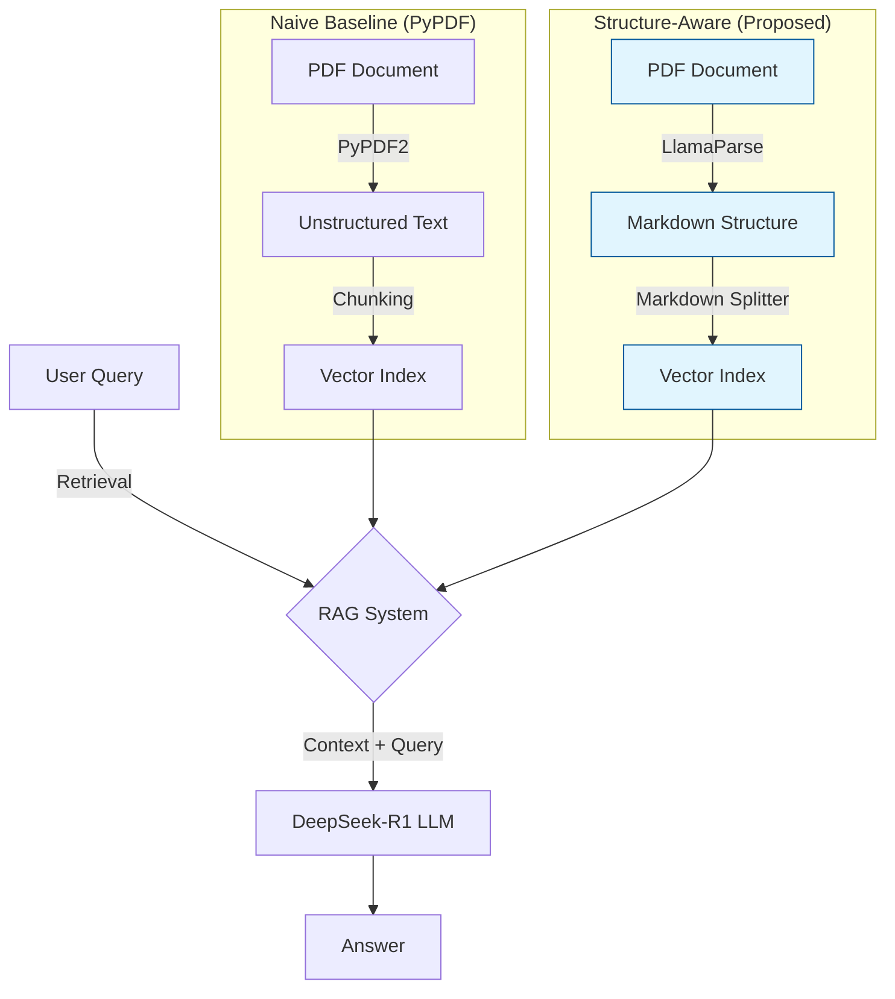
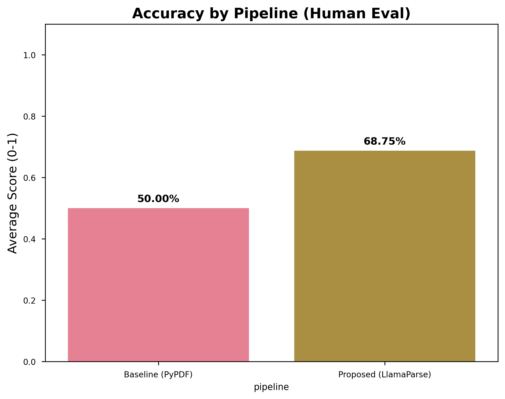
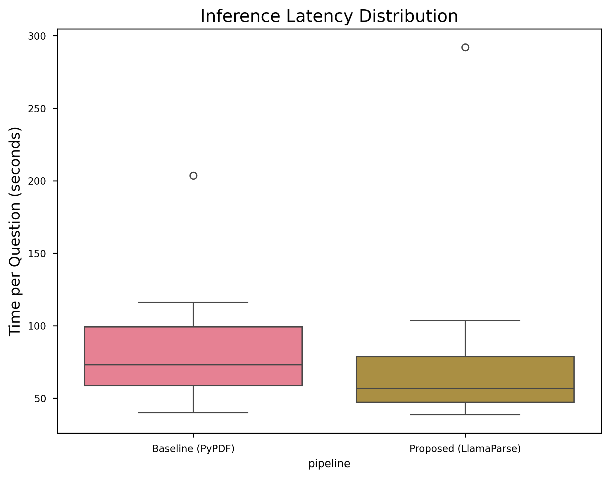

# 📊 Structure-Aware RAG: An Empirical Study on Financial Document Parsing

[](https://www.python.org/)
[](LICENSE)
[](report/README.md)
[](report/README.md)
[](https://www.llamaindex.ai/)

## 📋 Table of Contents
- [Executive Summary](#-executive-summary)
- [Motivation](#-motivation)
- [Experimental Design](#-experimental-design)
- [Key Results](#-key-results)
- [Technical Highlights](#-technical-highlights)
- [Project Structure](#-project-structure)
- [How to Reproduce](#-how-to-reproduce)
- [Technical Skills Demonstrated](#-technical-skills-demonstrated)
- [References](#-references)
- [License](#-license)

---

## ⚡ Executive Summary

**Problem**: Standard RAG (Retrieval-Augmented Generation) pipelines notoriously fail on semi-structured data such as tables, leading to severe hallucinations in financial reasoning tasks.

**Solution**: This project implements a **Structure-Aware Parsing Pipeline** using Markdown-based document representation and compares it against a **Naive Baseline** using unstructured text extraction.

**Key Finding**: Structure-aware parsing improves numerical reasoning accuracy from **50.0% to 68.8%** (+37.5% relative improvement), effectively eliminating hallucinations in cross-row comparison tasks.

> 📄 **[Read the Full Technical Report →](report/README.md)**

---

## 🎯 Motivation

Financial documents (10-K filings, earnings reports, balance sheets) are **highly heterogeneous** and rely heavily on complex tables to convey critical numerical information. When these tables are flattened into plain text by standard PDF extractors, the spatial relationships between headers, rows, and values are destroyed.

This creates what we term the **"Structure-Gap"** — a fundamental mismatch between how humans interpret tabular data and how LLMs receive it through naive text pipelines.

**Research Question**: *Can preserving document structure through Markdown-based parsing significantly improve RAG accuracy on financial reasoning tasks?*

**Research Question**: *Can preserving document structure through Markdown-based parsing significantly improve RAG accuracy on financial reasoning tasks?*

---

## 🏗️ System Architecture



---

## 🧪 Experimental Design

| Component | Baseline (Control) | Proposed (Experiment) |
| :--- | :--- | :--- |
| **Document Parsing** | PyPDF2 (Unstructured Text) | **LlamaParse (Markdown Structure)** |
| **Vector Indexing** | Dense Vector Index (BGE-Large) | Dense Vector Index (BGE-Large) |
| **LLM Reasoning** | DeepSeek-R1 8B (Local) | DeepSeek-R1 8B (Local) |
| **Evaluation** | Human-in-the-loop (N=8) | Human-in-the-loop (N=8) |

### Dataset
- **Source**: NVIDIA Corporation Fiscal Year 2024 Annual Report (10-K Filing)
- **Focus**: Consolidated Statements of Income (Pages 34-36)
- **Benchmark**: 8 curated questions spanning Simple Lookup and Cross-Column Comparison tasks

---

## 📈 Key Results

<p align="center">
  
  
</p>

| Metric | Baseline | Proposed | Improvement |
|--------|----------|----------|-------------|
| **Overall Accuracy** | 50.0% | 68.8% | +37.5% (relative) |
| **Revenue Lookup** | 0% | 100% | ∞ |
| **Cross-Column Tasks** | Partial | Full | Significant |
| **Avg. Latency** | ~45s | ~47s | Negligible overhead |

### Key Insights
1. **Structure Preservation is Critical**: The baseline completely failed on revenue lookup tasks due to destroyed table alignment.
2. **Latency Trade-off is Minimal**: The ~2s additional latency is negligible for batch processing scenarios.
3. **Semantic Ambiguity Persists**: Fine-grained distinctions (e.g., "Basic" vs. "Diluted" EPS) still require advanced retrieval techniques.

---

## 🛠️ Technical Highlights

| Feature | Description |
|---------|-------------|
| **Fault Tolerance** | Implemented `SafeMode` with incremental checkpointing to handle local LLM inference instability |
| **Resource Management** | Aggressive GPU memory garbage collection optimized for consumer-grade hardware (RTX 4060, 8GB VRAM) |
| **Async Processing** | Asyncio-based concurrent evaluation with configurable parallelism |
| **Reproducibility** | Full datasets, evaluation scripts, and configuration files provided |

---

## 📁 Project Structure

```
structure-aware-rag-study/
├── src/
│   ├── parsing/           # Document parsing pipelines
│   │   └── generate_datasets.py
│   ├── experiments/       # Experiment runners
│   │   └── run_comparison.py
│   └── evaluation/        # Scoring and visualization
│       ├── auto_score.py
│       └── visualize.py
├── config/
│   └── hardware_config.py # Hardware optimization settings
├── scripts/
│   ├── init_project.py    # Project initialization
│   └── verify_hardware.py # GPU/CUDA verification
├── data/
│   ├── raw_pdfs/          # Source documents
│   ├── benchmark/         # Golden dataset (Q&A pairs)
│   ├── parsed/            # Parsed outputs (gitignored)
│   └── chroma_db/         # Vector index (gitignored)
├── experiments/           # Experiment results
│   ├── comparison_results.csv
│   └── scored_results.csv
├── report/                # Technical report & visualizations
│   ├── README.md          # Full technical report
│   ├── accuracy_comparison.png
│   └── latency_distribution.png
├── requirements.txt
├── LICENSE
└── README.md
```

---

## 🚀 How to Reproduce

### Quick Start (Pre-requisites: Python 3.10+, CUDA recommended)

1.  **Clone & Install**
    ```bash
    git clone https://github.com/Zhi-Chao-PAN/structure-aware-rag-study.git
    cd structure-aware-rag-study
    pip install -r requirements.txt
    ```

2.  **Configure Environment**
    ```bash
    cp .env.example .env
    # Add your LlamaParse API key to .env
    ```

3.  **Run Comparison**
    ```bash
    # Run end-to-end experiment (Parsing -> Indexing -> Evaluation)
    python src/experiments/run_comparison.py --safe
    ```


### Run Experiment

```bash
# Generate parsed datasets (requires LlamaParse API key)
python src/parsing/generate_datasets.py

# Run comparison experiment
python src/experiments/run_comparison.py --safe  # Safe mode for stability

# Score results (auto + manual verification)
python src/evaluation/auto_score.py

# Generate visualizations
python src/evaluation/visualize.py
```

---

## 🎓 Technical Skills Demonstrated

This project showcases proficiency in:

| Domain | Skills |
|--------|--------|
| **NLP/LLM** | RAG pipeline design, prompt engineering, local LLM deployment (Ollama) |
| **ML Engineering** | Vector embeddings (HuggingFace), similarity search, GPU optimization |
| **Software Engineering** | Async programming, fault-tolerant design, checkpoint/resume patterns |
| **Data Science** | Experimental design, statistical evaluation, data visualization (Matplotlib/Seaborn) |
| **Research Methods** | Ablation studies, controlled experiments, reproducibility practices |

---

## 📚 References

1. Lewis, P., et al. (2020). *Retrieval-Augmented Generation for Knowledge-Intensive NLP Tasks*. NeurIPS.
2. Liu, J., et al. (2024). *LlamaIndex: A Data Framework for LLM Applications*. [llamaindex.ai](https://www.llamaindex.ai/)
3. Xiao, S., et al. (2023). *BGE: BAAI General Embedding*. arXiv:2309.07597
4. NVIDIA Corporation. (2024). *Annual Report (Form 10-K)*. SEC Filing.

---


---

## 📝 Citation

If you find this research useful, please cite it:

```bibtex
@misc{pan2026structureaware,
  author = {Zhichao Pan},
  title = {Structure-Aware RAG: An Empirical Study on Financial Document Parsing},
  year = {2026},
  publisher = {GitHub},
  journal = {GitHub repository},
  howpublished = {\url{https://github.com/Zhi-Chao-PAN/structure-aware-rag-study}}
}
```

---

## 📄 License

This project is licensed under the MIT License - see the [LICENSE](LICENSE) file for details.

---

<p align="center">
  <i>Developed as part of independent research on RAG systems for financial document analysis.</i>
</p>
